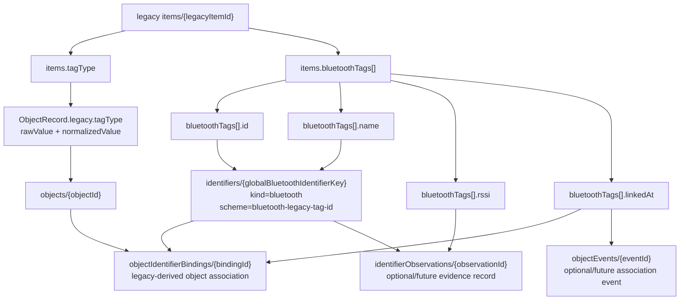
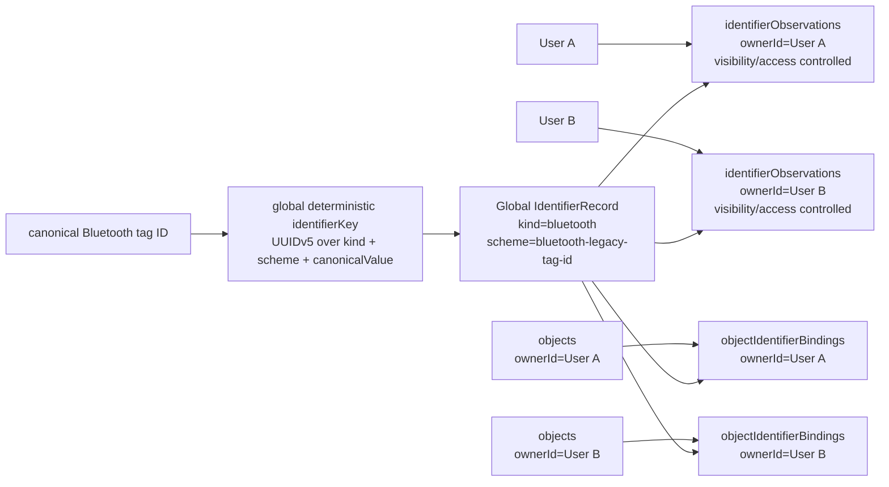
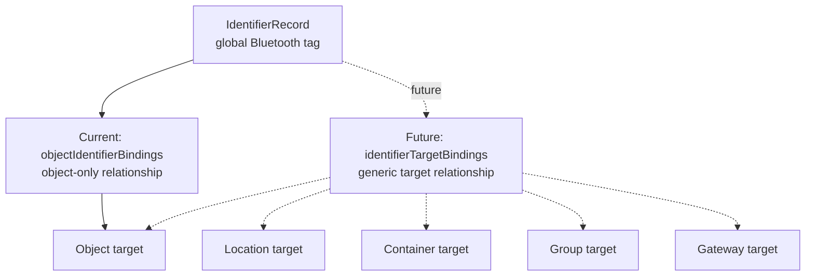
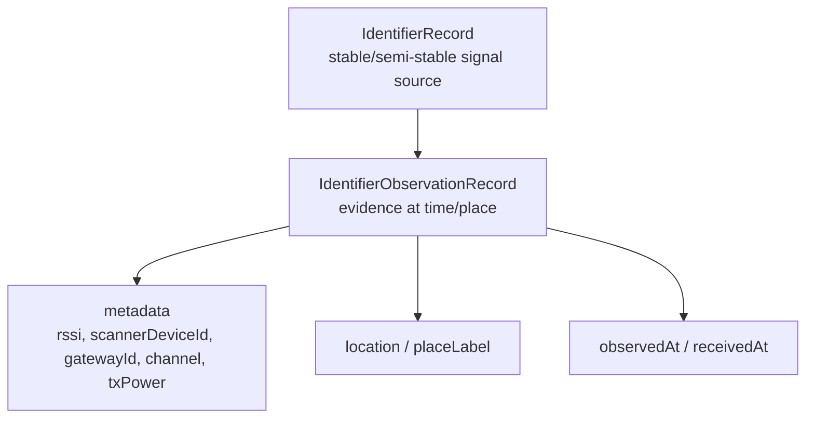

# Bluetooth Global Identity Data Model

> Status note:
> This document predates the Entity / Fact / Projection terminology. The legacy term "Identifier" now conceptually maps to "Marker", and "Binding" maps to "Association". Use `docs/architecture/entity-fact-projection-data-model.md` and `docs/migrations/entity-fact-projection-runtime-migration-plan.md` as the current architectural references.


**Note:** This document serves as a Bluetooth-specific appendix. For the primary conceptual model covering all identifiers, see:
[Ownerless Global Identifier Model](./ownerless-global-identifier-model.md)

## Scope

This document visualizes the adopted design model for ordinary unified identifiers where Bluetooth is `kind = "bluetooth"` with a Bluetooth-specific `scheme`, including:

* legacy `items.tagType`
* legacy `items.bluetoothTags`
* Bluetooth identifiers under the unified identifier model
* object bindings
* observations
* RSSI metadata
* `linkedAt` timestamp handling
* future `identifierTargetBindings`
* future `observationSets`

This is a design/documentation document.
It is not a live database browser.
It does not mean runtime schema has already changed.
It does not unblock Phase 7E by itself.

## Adopted decisions

* Bluetooth tag identity scope is global.
* A canonical Bluetooth tag ID maps to the same identifier across users.
* Bluetooth identifier identity is independent of `ownerId`.
* Bluetooth identifier identity is independent of `legacyItemId`.
* `ownerId` remains on owner-specific records such as observations, bindings, claims, visibility records, and migration provenance.
* `bluetoothTags[].id` maps to canonicalization input and `IdentifierRecord.canonicalValue`.
* `bluetoothTags[].name` maps to `IdentifierRecord.label`.
* `bluetoothTags[].rssi`, if present, belongs to observation metadata.
* `bluetoothTags[].linkedAt`, if present, is a binding/event timestamp candidate.
* `items.tagType` is preserved in legacy metadata as raw and normalized values.
* `tagType` alone must not create identifier records.

## Current schema caveat

* Current implemented `IdentifierRecord` includes `ownerId`.
* Global Bluetooth identity means identifier identity must not be owner-scoped.
* Therefore, implementation will require a careful additive schema/rules design.
* Possible implementation approaches must be evaluated later:
  * reinterpret `IdentifierRecord.ownerId` as creator/registrar for Bluetooth identifiers under the unified identifier model;
  * add a separate global identifier registry concept;
  * add ownership/claim records separate from identifier identity;
  * use global identifier key while keeping access-controlled owner-scoped observations and bindings.
* Do not implement any of these options in this task.

## Legacy source to target mapping

| Legacy source field              | Target / interpretation                                                                      | Status  |
| -------------------------------- | -------------------------------------------------------------------------------------------- | ------- |
| `items.tagType`                  | `ObjectRecord.legacy.tagType.rawValue` and normalized metadata                               | Decided |
| `items.bluetoothTags[]`          | source array for Bluetooth identifier candidates                                             | Decided |
| `items.bluetoothTags[].id`       | global Bluetooth canonicalization input / `canonicalValue`                              | Decided |
| `items.bluetoothTags[].name`     | `IdentifierRecord.label`                                                                     | Decided |
| `items.bluetoothTags[].rssi`     | `IdentifierObservationRecord.metadata.rssi` candidate                                        | Decided |
| `items.bluetoothTags[].linkedAt` | binding/event timestamp candidate                                                            | Decided |
| legacy item document ID          | migration provenance and binding context, not Bluetooth identity                             | Decided |
| `items.ownerId`                  | owner-specific binding/observation/provenance/access-control context, not Bluetooth identity | Decided |

## Mermaid: legacy mapping flow



## Mermaid: global Bluetooth identity model



* global identifier identity does not imply globally public observations.
* observations and bindings still need visibility/security policy.
* global identity enables community-level aggregation while keeping per-record access control separate.

## Mermaid: current vs future target binding



* current migration dry-run can propose object bindings from legacy item context.
* this must not be generalized to mean Bluetooth tags are always object-exclusive.
* future generic target binding remains design-only.

## Mermaid: observation metadata model



* RSSI/gateway/scanner/txPower/linkedAt are not identifier identity fields and belong to observation/binding/event/provenance layers.
* RSSI is not a stable tag property.
* RSSI depends on observation context.
* `linkedAt` is not RSSI-like measurement data; it is an association timestamp candidate.

## Deterministic ID payload

The Bluetooth semantic identity payload is JCS-canonicalized. The UUIDv5 key is computed over the JCS UTF-8 payload.

```json
{
  "app": "scan.moukaeritai.work",
  "idKind": "identifier",
  "identitySchemaVersion": 1,
  "canonicalizationVersion": 1,
  "kind": "bluetooth",
  "scheme": "bluetooth-legacy-tag-id",
  "canonicalValue": "<canonicalizedBluetoothTagId>"
}
```

*Note: Older migration sketches used a Bluetooth-specific field name (`bluetoothTagCanonicalValue`), but the canonical identity payload should now use the generic `canonicalValue` field.*

* `legacyItemId` belongs in binding/provenance output, not identifier identity.
* `ownerId` belongs in owner-scoped observations/bindings/claims/access-control records, not identifier identity. `objectId` and `legacyItemId` are also excluded from identifier identity.
* global key collision checks must be global, not owner-scoped.

## Remaining implementation work

* update dry-run design to global identity
* implement read-only Bluetooth legacy dry-run
* design global identifier access/rules
* decide whether current `identifiers.ownerId` can remain, needs reinterpretation, or requires a new ownership/claim model
* decide object binding vs future generic target binding implementation path
* preserve `tagType` under object legacy metadata
* validate all source fields with live-data audit
* update TypeScript schema only in a later explicit schema phase
* update Firestore rules only in a later explicit rules phase
* update firebase-blueprint only in a later explicit schema phase
* keep Phase 7E blocked until all source fields are classified and implementation is validated
