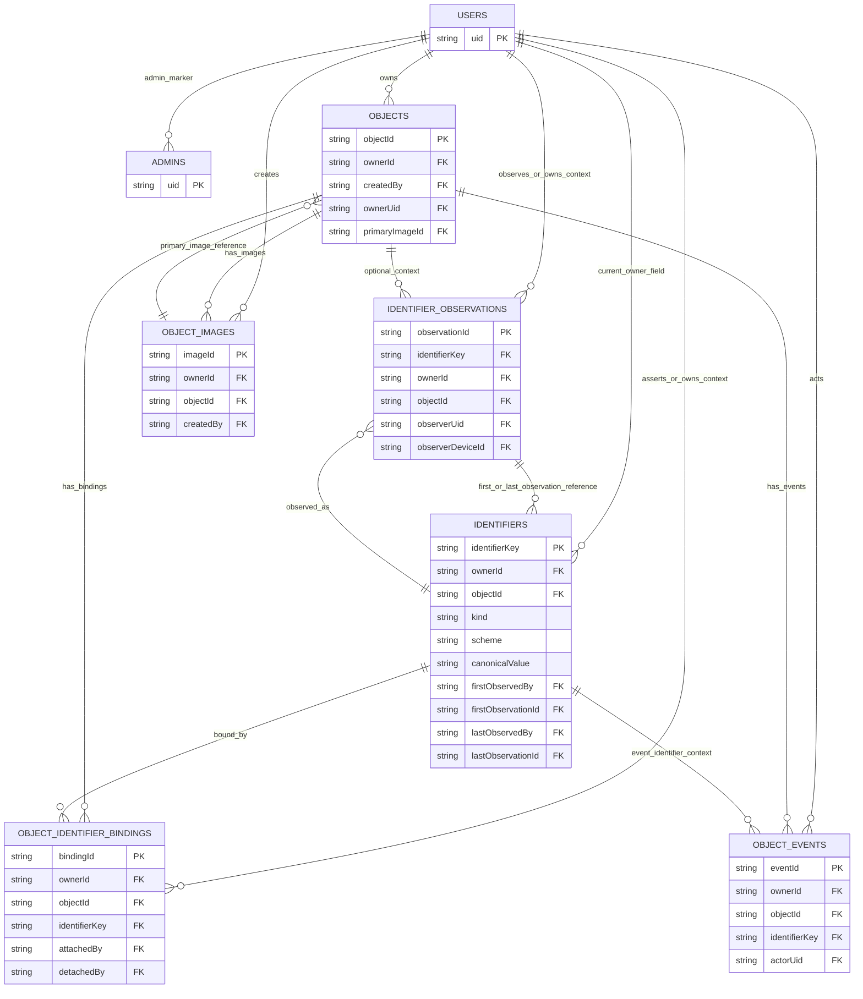
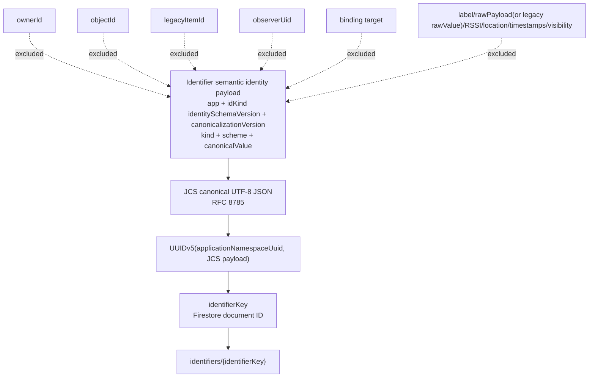
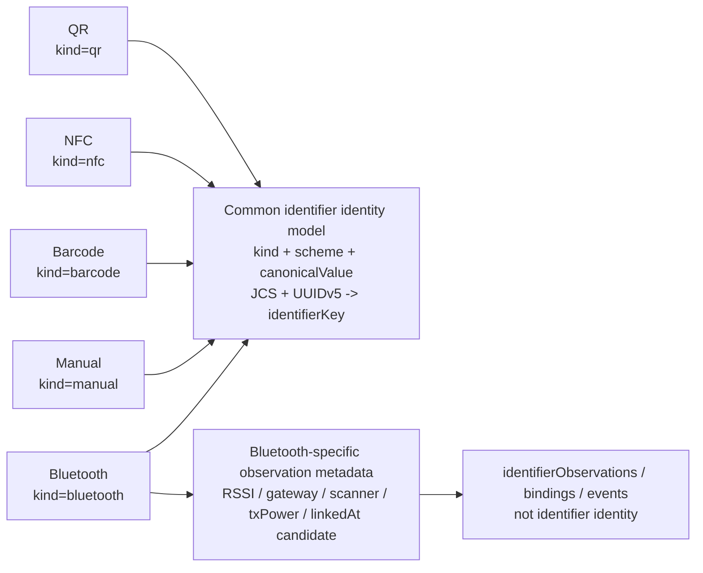

# Database Identity ER Diagram

> Status note:
> This document predates the Entity / Fact / Projection terminology. The legacy term "Identifier" now conceptually maps to "Marker", and "Binding" maps to "Association". Use `docs/architecture/entity-fact-projection-data-model.md` and `docs/migrations/entity-fact-projection-runtime-migration-plan.md` as the current architectural references.

## Scope

- This document is documentation only.
- It is not a live database browser.
- It intentionally omits non-identity descriptive fields.
- It focuses on keys, identity fields, and references.
- Current runtime schema still contains required `IdentifierRecord.ownerId`.
- Conceptual identifier identity is ownerless/global.
- Phase 7E remains blocked.

## Identity categories

- Object identity: `objects/{objectId}`
- Identifier semantic identity: JCS payload over `app`, `idKind`, `identitySchemaVersion`, `canonicalizationVersion`, `kind`, `scheme`, `canonicalValue`
- Identifier document identity: `identifiers/{identifierKey}`, where `identifierKey = UUIDv5(applicationNamespaceUuid, JCS(identifierSemanticIdentityPayload))`
- Observation identity: `identifierObservations/{observationId}`
- Binding identity: `objectIdentifierBindings/{bindingId}`
- Event identity: `objectEvents/{eventId}`
- Image identity: `objectImages/{imageId}`
- User / actor identity: Firebase Auth UID
- Admin marker identity: `admins/{uid}`
- Legacy provenance identity: `sourceCollection + sourceDocumentId` or equivalent legacy reference

Clarifications:
- Identifier identity is the only global/ownerless semantic identity currently decided.
- Other records have document identities but carry owner/observer/actor/asserter/target context.
- Bluetooth is not a separate identity model; it is `IdentifierRecord.kind = "bluetooth"` with a Bluetooth-specific `scheme`.

## Mermaid ER diagram: current implemented collections

Notes:
- In `IDENTIFIERS`, `ownerId` is current runtime compatibility context and future optional/non-identifying.
- In `IDENTIFIERS`, `objectId` is an optional compatibility relation and not identifier semantic identity.
- `kind`, `scheme`, and `canonicalValue` are semantic identity fields.

## Mermaid flowchart: identifier identity derivation

- `ownerId`, `objectId`, `legacyItemId`, `observerUid`, binding target, label, rawPayload (or legacy rawValue), RSSI, location, timestamps, and visibility are not part of identifier identity.
- `identityModelVersion` is stored on `IDENTIFIERS` as runtime interpretation metadata and does not participate in UUIDv5 payload derivation.
- Future v2 design uses optional non-identifying `rawPayload`; current runtime `rawValue` (legacy/current) also does not participate in identity.
- `canonicalValue` participates in identity.
- `identifierKey` is not arbitrary; it is derived from semantic identity.

## Mermaid flowchart: Bluetooth as ordinary identifier kind

- Bluetooth is not a separate identity system.
- Bluetooth-specific handling belongs mostly to canonicalization, scheme definition, observation metadata, privacy policy, and conflict handling.
- Bluetooth RSSI and proximity evidence belong to observations, not identifier identity.

## Key/reference table

| Entity / concept | Primary/document key | Semantic identity fields | References / foreign keys | Scope |
|---|---|---|---|---|
| `objects` | `objectId` | N/A (object identity is document identity) | `ownerId`, `createdBy`, `ownerUid`, `primaryImageId` | Owner-scoped object records |
| `identifiers` | `identifierKey` | JCS payload over `app`, `idKind`, `identitySchemaVersion`, `canonicalizationVersion`, `kind`, `scheme`, `canonicalValue` | current runtime `ownerId`, optional compatibility `objectId`, observation references (`firstObservedBy`, `firstObservationId`, `lastObservedBy`, `lastObservationId`) | Global/ownerless identifier identity; `ownerId` is runtime compatibility, not semantic identity |
| `objectIdentifierBindings` | `bindingId` | N/A for identifier semantics | `ownerId`, `objectId`, `identifierKey`, `attachedBy`, `detachedBy` | Relationship/assertion context; binding is not identifier identity |
| `identifierObservations` | `observationId` | N/A for identifier semantics | `identifierKey`, `observerUid`, `ownerId`, `objectId`, `observerDeviceId` | Observation/context evidence; not identifier identity |
| `objectEvents` | `eventId` | N/A for identifier semantics | `ownerId`, `objectId`, `identifierKey`, `actorUid` | Operational/audit history context |
| `objectImages` | `imageId` | N/A for identifier semantics | `ownerId`, `objectId`, `createdBy` | Image metadata context |
| `users` | `uid` | Firebase Auth user identity | N/A | User/actor identity |
| `admins` | `uid` | Admin marker identity via UID | references `users/{uid}` by convention | Admin capability marker |
| future `identifierTargetBindings` | `bindingId` | N/A for identifier semantics | `identifierKey`, `targetKind`, `targetId`, `assertedBy`, `ownerId` | Future conceptual generic target relation |
| future `observationSets` | `observationSetId` | N/A for identifier semantics | observer/device/gateway/session references | Future conceptual observation grouping |
| legacy `items` provenance | legacy item document ID | legacy source identity only | `sourceCollection`, `sourceDocumentId` or equivalent legacy reference | Migration provenance context |

## Future collections

These are conceptual and not implemented current production collections unless current code explicitly adds them.

- `identifierTargetBindings`
  - key: `bindingId`
  - references: `identifierKey`, `targetKind`, `targetId`, `assertedBy`, `ownerId`
  - purpose: generic relation between identifier and object/location/container/group/gateway

- `observationSets`
  - key: `observationSetId`
  - references: observer/device/gateway/session context
  - purpose: grouping multiple observations from a scan session or time-proximate detection set

- `identifierClaims`
  - key: `claimId`
  - references: `identifierKey`, claimant/asserter uid, optional target
  - purpose: user/community assertions about labels, ownership claims, meanings, or visibility
